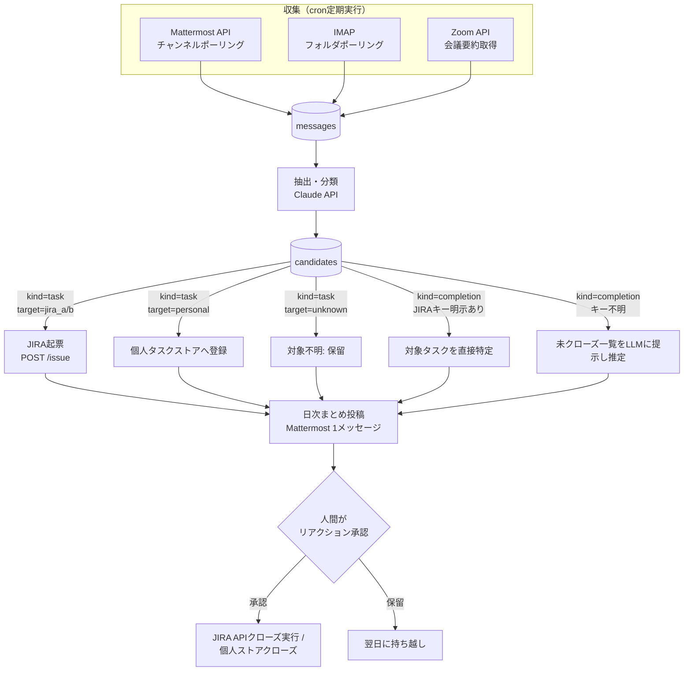
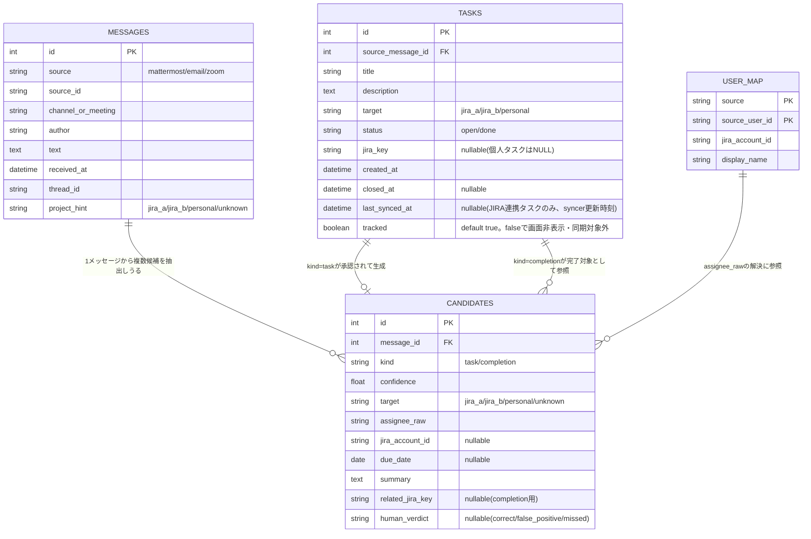
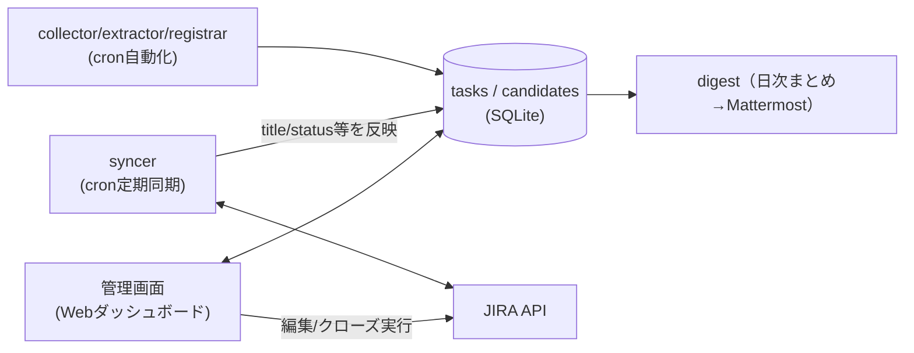

# 検討案: タスク管理自動化(JIRA/個人タスク)の設計（task-management-automation）

- 起票: 2026-09-12 / タスクID: `task-management-automation`（`/work`メインリポジトリの
  docs/task-queue.md 参照。タスク管理・進捗はこのリポジトリではなく`/work`側で追跡している）
- 目的: JIRA2プロジェクト＋個人タスク（Mattermost/メールで飛んでくる、現状管理不在）を対象に、
  (1) Mattermost/メール/Zoomからのタスク自動収集、(2) 打ち合わせ内容からのJIRA自動起票、
  (3) 完了確認による完了候補提示、(4) 画面でのタスク状況確認・更新・削除・クローズ、を実現する
  仕組みを設計する。
- 状態: 論点A/B/C・情報取り扱い方針とも決定済み（A2・B1・C2採用）。Zoom収集・JIRA連携（2プロジェクト
  ＋個人タスク）まで含めた実装設計が完了。次は実装フェーズ

## 背景・現状

- JIRAはプロジェクトごとに別管理（2プロジェクト）。
- 個人タスクはMattermost/メールで依頼されるが、専用の管理先がなく漏れやすい。
- ユーザー確認済みの前提:
  - 完了判定(クローズ)は**候補提示＋人間承認**とする（自動クローズはしない）。JIRAの誤クローズは
    気づかれにくく実害が大きいため。
  - 利用可能な基盤: Zoom文字起こし/要約API、Claude API等のLLM呼び出し、JIRA/Mattermostの
    bot・Webhook権限、Dockerコンテナ＋cronでの定期実行環境。
- 未確認事項: 個人タスクの格納先（JIRAに寄せるか専用ツールか）、会議・メール本文を外部LLM API
  （Anthropic等）に送ってよいかの情報取り扱いポリシー。

## 全体パイプライン（図解、2026-09-12）

- **収集**: 収集源ごとに独立してcronポーリングし、共通の`messages`テーブルへ集約する。
- **抽出・分類**: `messages`1件ごとにClaude APIで構造化抽出し`candidates`へ格納する。
- **登録/完了候補提示/実行**: `target`と`kind`に応じて枝分かれし、いずれも最終的に日次まとめ
  （digest）に集約される。実際にクローズを実行するのは人間がリアクション承認した分のみ。

## 方針案

### 論点A: 個人タスクの格納先

| 案 | 内容 | コスト | リスク | 状態 |
|---|---|---|---|---|
| A1 | JIRAに個人用の第3プロジェクトを作り、JIRA1箇所に集約 | 低（既存API流用） | 個人用途にはJIRAの項目が過剰で入力が重い | 不採用 |
| A2 | 軽量な自前ストア（例: このリポジトリのtask-queue.mdに近いMarkdown、またはSQLite+簡易UI）を新設 | 中（UI/ストアを新規構築） | JIRAと別の場所を見る手間が増える | **採用**（2026-09-12） |

### 論点B: 収集トリガー方式

| 案 | 内容 | コスト | リスク | 状態 |
|---|---|---|---|---|
| B1 | cronでの定期ポーリング（Mattermost API/IMAPを5〜15分間隔で取得） | 低 | リアルタイム性はやや低い | **採用**（2026-09-12） |
| B2 | Mattermost outgoing webhook等でのイベント即時受信 | 中（受信用エンドポイントが必要） | 常時稼働の受信サービスが必要になる | 不採用 |

### 論点C: 完了候補の承認UI

| 案 | 内容 | コスト | リスク | 状態 |
|---|---|---|---|---|
| C1 | Mattermost botのDMで個別に「クローズしてよいか」を都度確認 | 中 | 通知が多いと承認疲れが起きうる | 不採用 |
| C2 | 日次で「本日のクローズ候補一覧」を1メッセージにまとめて投稿し、リアクションで一括承認 | 中 | 即時性は下がるが承認負荷は低い | **採用**（2026-09-12） |

## リスク・懸念

- 誤検知（過検知/見逃し）: 初期は「登録も提案のみ」でノイズ率を計測してから自動登録の範囲を広げる
  段階導入が安全。
- 情報取り扱い: 会議内容・メール本文を外部LLM API（Anthropic等）に送信することになる（2026-09-12
  ユーザー確認: 問題なし）。
- 監視範囲: Mattermost/メールの全チャンネル・全メールを対象にせず、監視対象を明示的に絞る設計とする。

## ユーザー判断の反映（2026-09-12）

- 情報取り扱い: 会議内容・メール本文を外部LLM API（Claude API等）に送信することは問題なし。
- 論点A（個人タスクの格納先）: A2（軽量な自前ストア）を採用。JIRAには個人用プロジェクトを
  作らず、専用の別ストアで管理する。
- 論点B（収集トリガー）: B1（cron定期ポーリング）を採用。
- 論点C（完了候補の承認UI）: C2（日次まとめ＋リアクション一括承認）を採用。

## 確定した設計（2026-09-12時点）

- 収集: cron定期実行（Dockerコンテナ）でMattermost API/IMAPをポーリング、Zoomは会議終了webhook
  経由でAPIから要約・文字起こしを取得。
- 抽出・分類: Claude APIで「タスク依頼か」「担当者」「対象(JIRA-A/JIRA-B/個人)」「期限」を
  構造化抽出。不明な項目は断定させない。
- 登録: JIRA案件はJIRA REST APIで起票。個人タスクは新設する軽量な自前ストアに登録。
- 完了候補: 自動クローズせず、日次で「本日のクローズ候補一覧」をMattermostに1メッセージで
  投稿し、リアクションで一括承認 → 承認分のみJIRA API/自前ストアでクローズを実行。

## 実装設計（Zoom収集・JIRA連携含む、2026-09-12）

パイロット段階は設けず、Mattermost/メール/Zoomの3収集源とJIRA2プロジェクト＋個人タスクストア
への登録・クローズまでを対象にした設計とする。

### データモデル（ER図、SQLite。個人タスクストア＝論点A2の実体もここから育てる）

- `messages.project_hint`は収集元の設定（`project_routing`、後述）から機械的に付与する
  「対象プロジェクトの手がかり」。抽出時にLLMへ渡すコンテキストとして使う。
- `tasks.jira_key`はJIRA起票済みなら値あり、個人タスクはNULLのまま自前ストアの実体となる。
- `user_map`未整備の担当者はassignee未設定で登録し、日次まとめで人間に確認する。
- `project_routing`（監視対象チャンネル/メールフォルダ/Zoom会議シリーズ名 → `project_hint`の
  マッピング）はDBではなく設定ファイルで管理するため、ER図には含めていない。

### データの実体・同期方針（2026-09-12）

- **JIRA連携タスク**（`tasks.jira_key`が値を持つ行）は**JIRAが唯一の正**。ローカルの
  `title`/`description`/`status`等はJIRAの状態を映した**キャッシュ**として扱い、崩れてもJIRAから
  作り直せるものと位置づける。
- **syncer**（cron、収集と同程度の間隔・目安10〜15分毎）が追跡中の`jira_key`一覧をJIRA API
  （バッチ取得: JQL `key in (...)`）で問い合わせ、ローカルの`tasks`行へ反映し
  `last_synced_at`を更新する。
- ダッシュボードは通常ローカルDBを読んで高速表示し、「今すぐ更新」操作で対象タスクのみ即時に
  JIRAへ再取得できるようにする。
- ダッシュボードからの編集（title/description/due_date等）はローカルのみで完結させず、JIRA API
  へ書き込んだ上でローカルキャッシュも更新する（write-through。ローカルとJIRAの内容が
  ズレないようにする）。
- **個人タスク**（`jira_key`がNULLの行）は他に正となる外部システムが存在しないため、ローカルDBが
  そのまま正データとなる（syncer・write-through の対象外）。

### 追跡フラグ（`tracked`、2026-09-12）

「削除」（データ自体を消す）とは別に、**ローカルキャッシュには残したまま、画面表示や同期の対象
からだけ外す**設定を設ける。

- `tasks.tracked`（デフォルト`true`）を`false`にすると:
  - 管理画面のデフォルト一覧から非表示になる（「追跡除外分も表示」フィルタで確認は可能）。
  - `tracked=false`のJIRA連携タスクはsyncerの同期対象から外れる（無駄なJIRA API呼び出しを
    減らせる）。
  - 完了候補の対象特定（「未クローズタスク一覧」からLLMに推定させる処理）の候補からも除外する
    （関係ない古いタスクが完了候補として誤って挙がるのを防ぐ）。
  - 個人タスク・JIRA連携タスクのどちらにも使える。JIRA課題自体には一切影響しない。
- 管理画面から「追跡しない」「再度追跡する」をワンクリックで切り替え可能にする（可逆操作。
  削除ボタンとは別に用意する）。

### 収集（収集源ごと）

- **Mattermost**: cron10分間隔で監視対象チャンネル（複数可、プロジェクトA/B用チャンネルや個人
  DMなど）をポーリングし`messages`へ保存。チャンネルごとに`project_hint`を設定。
- **メール**: IMAPで監視対象フォルダ/ラベルをcronポーリング。フォルダごとに`project_hint`を設定。
- **Zoom**: cronでZoom API（Server-to-Server OAuth）を使い、終了済み会議一覧を取得。Zoom AI
  Companionの会議要約API（overview・next steps/action items）を取得し、要約全文を1件の
  `messages`（source=zoom）として保存する。会議トピック名・シリーズ名から`project_hint`を推定
  する。Zoom自身が抽出したaction itemsをextractorの入力に含めることで、ゼロから発言を解析する
  より精度を上げやすい。

### 抽出・分類

Claude APIに本文＋`project_hint`をコンテキストとして渡し、`kind/confidence/target/assignee_raw/
due_date/summary`を構造化JSONで抽出する。`target`は`project_hint`があれば強い手がかりとして使う
が、本文の内容と矛盾する場合は本文を優先し`confidence`を下げさせる。`assignee_raw`は生の名前/
メールアドレスのまま出力させ、後段で`user_map`を引いて`jira_account_id`に解決する（解決できな
ければ未設定のまま日次まとめで人間に確認を仰ぐ）。不明な項目は断定させず`unknown`とする。

### 登録（Registrar）

- **JIRA登録**: `target`が`jira_a`/`jira_b`で確定した候補はJIRA REST API
  （`POST /rest/api/2/issue`）で起票。descriptionに元発言/メール/会議へのリンクと引用を残す。
  `assignee`が解決できていれば設定し、できていなければ未設定で起票（担当者未設定の起票がある旨
  は日次まとめに含める）。
- **個人タスク登録**: `target=personal`の候補は自前ストア（`tasks`テーブル、`jira_key`はNULL）
  に登録する。
- **対象不明（`target=unknown`）**: 自動起票せず、日次まとめに「対象不明のタスク候補」として
  提示し、人間が対象（JIRA-A/B/個人）を指定した上で承認したときのみ登録する。

### 完了候補提示・クローズ

完了報告らしき発言を検知した場合、対象タスクの特定を2段階で行う。

1. 発言内にJIRAキー（例: `PROJ-123`）が明示されていればそれをそのまま`related_jira_key`とする。
2. 明示がなければ、`target`と`project_hint`から絞り込んだ「未クローズタスク一覧」
   （JIRA APIの検索結果＋自前ストアの`open`タスク）をLLMに渡し、該当しそうなものを
   confidence付きで推定させる。

日次で「本日のクローズ候補一覧」を1メッセージにまとめてMattermostへ投稿し（論点C2）、
リアクションで承認されたものだけJIRA API／自前ストアでクローズを実行する。対象不明の完了報告
（related_jira_keyが特定できないもの）はクローズ候補にせず「完了報告はあったが対象タスク不明」
として別掲し、人間が手動で対応する。

### 管理画面（ダッシュボード、2026-09-12）

日次まとめ(digest)はMattermostでの通知・承認フロー、ダッシュボードは随時のブラウジング・
手動操作用途とすみ分ける。

JIRA連携タスクについては、DASHの読み取りは基本ローカルDB（キャッシュ）から行い、正データである
JIRAとの整合はsyncerが定期的に保つ。DASHからの編集・クローズはJIRA APIへ直接書き込み、成功後に
ローカルキャッシュへも反映する。

- **対象データ**: `tasks`テーブル（JIRA連携・個人タスクを横断表示、`target`/`status`/`tracked`で
  フィルタ・ソート可能）。
- **一覧・詳細確認**: target(jira_a/jira_b/personal)・status(open/done)での絞り込み、
  元発言/メール/会議へのリンク表示。デフォルトは`tracked=true`のみ表示し、「追跡除外分も表示」
  トグルで`tracked=false`の行も確認できる。
- **更新**: title/description/due_date/target等の編集。
- **クローズ**: JIRA連携タスク（`jira_key`あり）はJIRA APIのステータス遷移実行を伴う。個人
  タスクは`status=done`への更新のみ。
- **追跡しない/再度追跡する**: `tasks.tracked`を切り替える可逆操作（詳細は上記「追跡フラグ」
  参照）。行はローカルに残したまま画面表示・syncer対象・完了候補マッチング対象から外す
  （外すだけなのでJIRA課題自体には影響しない）。
- **削除**: JIRA連携タスクは「追跡対象から外す」（`tasks`テーブルの行削除のみ。JIRA課題自体は
  変更しない——2026-09-12ユーザー確認: 誤操作でJIRA側を壊さない安全側を採用）。個人タスクは
  完全削除する。
- **技術・アクセス**: 軽量Webアプリ（例: FastAPI＋簡易フロントエンド）としてDockerコンテナ化し、
  自動化パイプラインと同居させSQLiteへ直接アクセスする。ローカルネットワーク/VPN経由での
  ブラウザアクセスを想定し、個人利用のためまずBasic認証程度から始める。

### 日次まとめ（digest）の構成

1メッセージの中で以下をカテゴリ分けして提示する。

1. 新規登録済みタスク（JIRA/個人、当日分）
2. 対象不明のため保留中のタスク候補（人間の判定待ち）
3. クローズ候補（承認待ち、リアクションで実行）
4. 完了報告はあったが対象タスク不明（手動対応が必要）

### リスク・注意点（追加）

- Zoom APIのレート制限・必要スコープ（会議情報・会議要約の読み取り権限）を事前に確認する必要
  がある。
- `user_map`が未整備だと担当者不明・対象不明が増えるため、初期構築時に主要メンバーの
  Mattermostユーザー名/メールアドレスとJIRAアカウントIDの対応表をあらかじめ用意しておく。
- 複数プロジェクトが混在するチャンネル/メールフォルダでは`project_hint`だけでは判定が弱いため、
  本文内容を優先しつつconfidenceで保留に倒す設計としている。

### 技術スタック

Python（リポジトリの既存方針どおりルートの`.venv`/uv環境を使用）、`sqlite3`標準ライブラリ、
`requests`でMattermost/JIRA/Zoom各API呼び出し（ZoomはServer-to-Server OAuth）、`anthropic` SDK
でClaude API呼び出し、Dockerコンテナ＋cronで定期実行。

## 想定される次の一手

1. 認証情報・権限の準備（ユーザー側）: Mattermost botトークン、JIRA APIトークン、Zoom
   Server-to-Server OAuthアプリ（会議情報・会議要約の読み取りスコープ）。
2. `project_routing`（監視対象チャンネル/メールフォルダ/Zoom会議シリーズと`project_hint`の対応）
   と`user_map`（主要メンバーの初期データ）を整備する。
3. collector（mattermost/email/zoom）・extractor・registrar（JIRA登録/個人タスク登録/クローズ
   実行）・digest（日次まとめ投稿）・管理画面（ダッシュボード）を実装する。
4. 運用開始後、precision/recall（登録・クローズ候補それぞれ）を継続的にモニタリングし、
   プロンプト・`project_routing`・confidence閾値を調整する。
