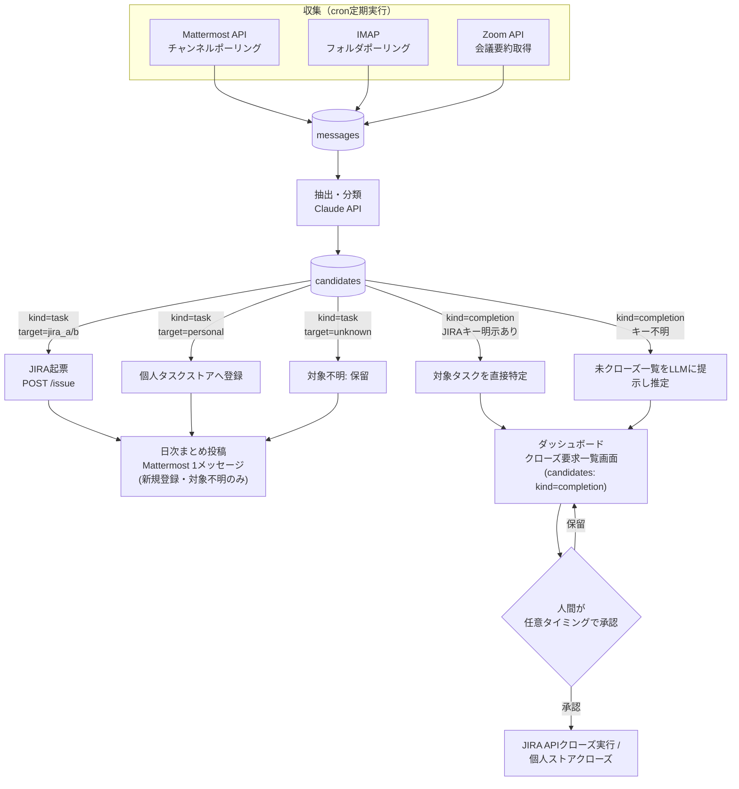
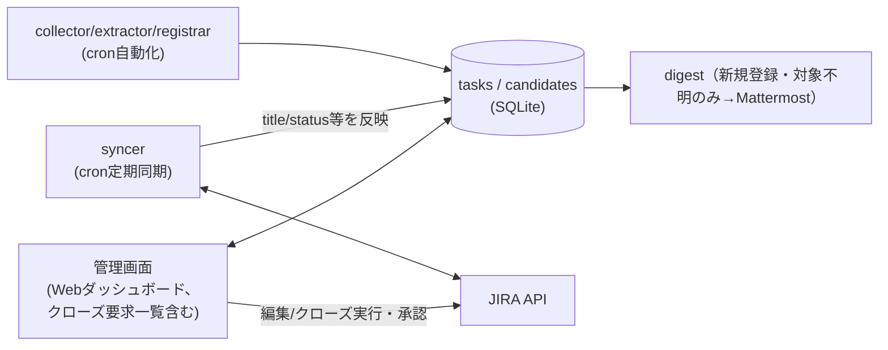

# タスク管理自動化 全体構想・ロードマップ

## 位置づけ

本ドキュメントは、タスク管理自動化構想（JIRA2プロジェクト＋個人タスクをMattermost/メール/
Zoomから自動収集し、JIRA自動起票・完了候補提示まで行う）の**背景・全体像・リスク・今後の
展望**をまとめたものである。個別機能の確定設計は、実装状況に応じて次のドキュメントへ
分けている（旧`docs/design/task-management-automation.md`を分割、経緯は
`docs/work-log.md` 2026-09-13「task-management-automation.mdを機能別に分割」参照）。

- **Mattermost分**（collector+extractor+確定target分のregistrar）は**実装済み**。詳細は
  `docs/design/data-model.md`「Mattermost extractor」節・`docs/design/screen-close-requests.md`・
  `docs/design/screen-task-candidates.md`参照。
- **メール/Zoom分**（collector/extractor/registrar/完了候補提示）は未実装。確定設計は
  `docs/design/mail-zoom-pipeline.md`参照。
- **JIRA同期（syncer）**は未実装。確定設計は`docs/design/jira-sync.md`参照。
- **日次まとめ（digest）**は未実装。確定設計は`docs/design/digest.md`参照。

このうち「スキーマとダッシュボードUI」部分はGo + sqlc + htmxで既にパイロット実装済みであり、
その詳細は`docs/design/design.md`を参照する（本書では重複させず、必要箇所からリンクする）。

## 背景・現状

- JIRAはプロジェクトごとに別管理（2プロジェクト）。
- 個人タスクはMattermost/メールで依頼されるが、専用の管理先がなく漏れやすい
  （→ [個人タスクの格納先](../adr/complete/personal-task-store.md)）。
- 完了判定(クローズ)は**候補提示＋人間承認**とする（自動クローズはしない。JIRAの誤クローズは
  気づかれにくく実害が大きいため。→
  [完了判定の自動化可否](../adr/complete/auto-close-policy.md)）。承認をどの画面で行うかは
  → [完了候補の承認UI](../adr/complete/completion-approval-ui.md)。
- 利用可能な基盤: Zoom文字起こし/要約API、Claude API等のLLM呼び出し、JIRA/Mattermostの
  bot・Webhook権限、Dockerコンテナ＋cronでの定期実行環境。
- 会議・メール本文を外部LLM API（Claude API等）に送信することはユーザー確認済み（問題なし。
  → [外部LLM API送信可否](../adr/proposals/data-handling-policy.md)。メール/Zoom分にのみ
  適用され、Mattermost分は別途ローカルLLMを使うため対象外。
  `docs/design/mail-zoom-pipeline.md`参照）。

## 全体パイプライン（構想時点の概念図）

- **収集**: 収集源ごとに独立してcronポーリングし、共通の`messages`テーブルへ集約する。
- **抽出・分類**: `messages`1件ごとにLLMで構造化抽出し`candidates`へ格納する。
- **登録**: `target`と`kind`に応じて枝分かれし、新規登録・対象不明の候補は日次まとめ
  （digest）に集約される。
- **完了候補提示/実行**: クローズ候補（`kind=completion`）はMattermostではなく、ダッシュボード
  の「クローズ要求一覧」画面にDBから随時表示する。実際にクローズを実行するのは、ユーザーが
  この画面で任意のタイミングで承認した分のみ。

**上図はメール/Zoomも含めた全体構想の概念図であり、Mattermost分の実装（2026-09-13）は
これと部分的に異なる**: `messages`への蓄積とバッチ抽出(`EXT`)を分離せず、収集した投稿を
その場で分類し、`kind=none`または低信頼度の投稿は`messages`にすら保存せず破棄する
（`docs/adr/complete/mattermost-message-retention.md`参照）。また`EXT`はClaude APIではなく
このホスト上のローカルLLMを使う（`docs/adr/complete/mattermost-extractor-llm-choice.md`参照）。
メール/Zoom実装時にこの図の通りの「蓄積してから一括抽出」方式にするか、Mattermostと同様
「取得時に都度分類」方式にするかは、着手時に改めて検討する（`docs/design/mail-zoom-pipeline.md`参照）。

上図のクローズ候補まわり（CLOSE1/CLOSE2 → ダッシュボード → 承認 → EXEC）は
[完了候補の承認UI](../adr/complete/completion-approval-ui.md)で採用した
C3（ダッシュボード内クローズ要求一覧）の構成。当初はC2（Mattermost日次まとめ＋リアクション
承認）を採用していたが、2026-09-13にC3へ変更した。日次まとめ（digest）は新規登録・対象不明の
タスク候補のみを扱い、クローズ候補の承認フローはdigestから切り離されている。

## 管理画面（ダッシュボード）との関係

日次まとめ(digest)は新規登録・対象不明タスクのMattermost通知用、ダッシュボードは随時の
ブラウジング・手動操作に加えてクローズ候補の承認UI（採用案C3）も担う。

JIRA連携タスクの読み取り・同期方針は`docs/design/jira-sync.md`参照（重複記述しない）。

ダッシュボード自体の対象データ・一覧/詳細確認・更新・追跡しない/再度追跡する・削除
（設けない方針）・技術スタックの詳細は、パイロット実装済みの`docs/design/design.md`
（および画面ごとの`docs/design/screen-board.md`・`docs/design/screen-close-requests.md`）を
参照（重複記述しない）。技術スタックの選定は
[ダッシュボードの実装技術](../adr/complete/dashboard-tech.md)、
statusの粒度は[タスクの進捗管理粒度](../adr/complete/status-granularity.md)、
削除を設けない方針は[「追跡除外」操作の範囲](../adr/complete/delete-vs-hide.md)
の採用結果。クローズ要求一覧画面（採用案C3）の業務ルール・現状の制約は
`docs/design/screen-close-requests.md`を参照。

## リスク・注意点

- 誤検知（過検知/見逃し）: 初期は「登録も提案のみ」でノイズ率を計測してから自動登録の範囲を
  広げる段階導入が安全（Mattermost分は`MinCandidateConfidence`しきい値と、`target`確定分のみ
  自動登録する段階導入を実施済み。`docs/design/data-model.md`「Mattermost extractor」節参照）。
- 監視範囲: Mattermost/メールの全チャンネル・全メールを対象にせず、監視対象を明示的に絞る
  設計とする（Mattermost分は`MATTERMOST_CHANNEL_ROUTES`環境変数で実装済み）。
- Zoom APIのレート制限・必要スコープ（会議情報・会議要約の読み取り権限）を事前に確認する必要
  がある。
- `user_map`が未整備だと担当者不明・対象不明が増えるため、初期構築時に主要メンバーの
  Mattermostユーザー名/メールアドレスとJIRAアカウントIDの対応表をあらかじめ用意しておく。
- 複数プロジェクトが混在するチャンネル/メールフォルダでは`project_hint`だけでは判定が弱いため、
  本文内容を優先しつつconfidenceで保留に倒す設計としている。

## 想定される次の一手

1. **Mattermost collector+extractor（収集+ローカルLLMでの分類+確定target分の自動登録）は
   実装済み**（`internal/mattermost/`、2026-09-13。`docs/design/data-model.md`
   「Mattermost extractor」節参照）。認証情報（Bot Token・サーバーURL・
   `MATTERMOST_CHANNEL_ROUTES`・ローカルLLMの接続先）はユーザーが自身の環境で設定する。
2. 残る認証情報・権限の準備（ユーザー側）: JIRA APIトークン、Zoom Server-to-Server OAuth
   アプリ（会議情報・会議要約の読み取りスコープ）、メールのIMAP認証情報。
3. `user_map`（主要メンバーの初期データ）を整備する（`project_routing`のうちMattermost分は
   `MATTERMOST_CHANNEL_ROUTES`で代替済み。メール/Zoom分は別途整備が必要。Mattermost extractorは
   `assignee_raw`の`jira_account_id`解決を現状行っていない）。
4. syncer（`docs/design/jira-sync.md`）・registrar（JIRA実APIへの自動起票）・digest
   （`docs/design/digest.md`）、メール/Zoom collector/extractor
   （`docs/design/mail-zoom-pipeline.md`）を実装する（管理画面（ダッシュボード）は
   スキーマ・クローズ要求一覧・タスク候補一覧画面含めパイロット実装済み。
   `docs/design/design.md`参照）。
5. 運用開始後、precision/recall（登録・クローズ候補それぞれ）を継続的にモニタリングし、
   プロンプト・`project_routing`・confidence閾値（`MinCandidateConfidence`）を調整する。

## 関連ドキュメント

- `docs/adr/proposals/`・`docs/adr/complete/` — 本書の各設計判断がなぜそうなったか（案の比較・
  採用理由）を論点ごとに記録したADR（本書の各所からリンクしている個別ファイル参照）。
- `docs/design/data-model.md` — DBスキーマ・ER図、および実装済みのMattermost extractorの
  確定仕様。
- `docs/design/design.md` — 「スキーマとダッシュボードUI」部分のパイロット実装（Go+sqlc+htmx）
  の全体方針。
- `docs/design/screen-board.md` / `docs/design/screen-close-requests.md` /
  `docs/design/screen-task-candidates.md` — ダッシュボード各画面
  （カンバンボード／クローズ要求一覧／タスク候補一覧）の詳細仕様。
- `docs/design/mail-zoom-pipeline.md` — メール/Zoom分の収集・抽出・登録・完了候補（未実装）。
- `docs/design/jira-sync.md` — JIRA同期方針（syncer、未実装）。
- `docs/design/digest.md` — 日次まとめ（digest、未実装）。
