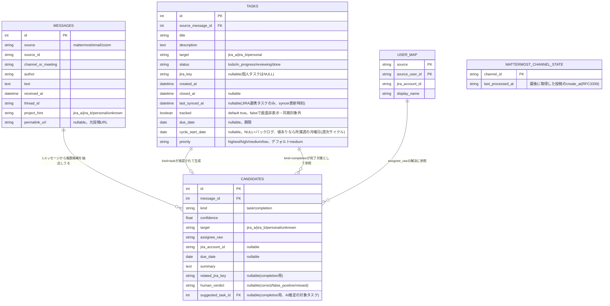

# データモデル（DB設計）

> 全体方針・技術スタックは`docs/design/design.md`、画面ごとの仕様は`docs/design/screen-*.md`を
> 参照。本書はDBスキーマ（`internal/taskstore/schema.sql`）自体の設計のみを扱う。

## テーブル一覧

| テーブル | 役割 | 主な列 |
|---|---|---|
| `messages` | Mattermost extractorがタスク化・候補化したメッセージのみを保持する（ノイズと判定された投稿は保存しない。`docs/adr/complete/mattermost-message-retention.md`参照）＋seed.goの固定サンプル | `source`(mattermost/email/zoom), `channel_or_meeting`, `author`, `text`, `received_at`, `project_hint`, `permalink_url`(元投稿URL、nullable) |
| `candidates` | メッセージから抽出したタスク/完了候補。`kind=task`はMattermost extractorが分類した新規タスク候補（`target`確定分は自動的に`tasks`へ登録され`human_verdict='auto_registered'`が設定される。不明分は「タスク候補一覧」画面で人間が承認/却下）、`kind=completion`は完了報告候補（「クローズ要求一覧」画面が参照。`related_jira_key`が無い場合、`suggested_task_id`にAI推定の対象タスクが入り`<select>`の初期選択肢になる。`docs/adr/complete/close-request-target-task-suggestion.md`参照） | `kind`(task/completion), `confidence`, `target`, `assignee_raw`, `due_date`, `summary`, `related_jira_key`, `human_verdict`(correct/false_positive/auto_registered等), `suggested_task_id`(nullable, FK→tasks.id) |
| `tasks` | ダッシュボードが実際に読み書きする本体 | `title`, `description`, `target`(jira_a/jira_b/personal), `status`(todo/in_progress/reviewing/done), `jira_key`, `created_at`, `closed_at`, `last_synced_at`, `tracked`(0/1), `due_date`(YYYY-MM-DD、nullable), `cycle_start_date`(所属週の月曜日、YYYY-MM-DD、nullable。NULL=バックログ), `priority`(highest/high/medium/low、デフォルトmedium) |
| `user_map` | 発言者⇔JIRAアカウントの対応（本パイロットでは表示画面からは未使用） | `source`, `source_user_id`, `jira_account_id`, `display_name` |
| `mattermost_channel_state` | Mattermost extractorがチャンネルごとにどこまで取得済みかを保持する（`messages`テーブルへの依存を無くしたカーソル管理、後述「Mattermost extractor」節参照） | `channel_id`(PK), `last_processed_at` |

## ER図

`internal/taskstore/schema.sql`（実装）と一致させたテーブル間のリレーション・列定義。

- `messages.project_hint`は収集元の設定（`project_routing`）から機械的に付与する「対象
  プロジェクトの手がかり」。`project_routing`自体はDBではなく設定ファイルで管理するため、
  ER図には含めていない（利用方法は`docs/design/task-management-automation.md`の
  「抽出・分類」参照）。
- `tasks.jira_key`はJIRA起票済みなら値あり、個人タスクはNULLのまま自前ストアの実体となる。

## 週次サイクル（Cycles）

Linear風の「今週/バックログ」区分を`tasks.cycle_start_date`のみで表現し、独立した
Cycleテーブルは持たない（過去サイクルの履歴参照は要件外のため。比較検討の経緯は
`docs/adr/complete/cycle-data-model.md`参照）。`internal/taskstore/rollover.go`が
週境界（月曜0:00 JST）を跨いだ未完了タスクの`cycle_start_date`を現在の週の月曜日へ
書き換える（常駐goroutine＋起動時キャッチアップ実行、外部通信なし。詳細は
`docs/design/screen-board.md`「週次繰り越し」節、実行方式の検討経緯は
`docs/adr/complete/cycle-rollover-execution.md`参照）。

## 優先度（priority）

`tasks.priority`（highest/high/medium/low、デフォルトmedium）はLinear風の優先度概念を取り込んだ
もので、`target`（personal/jira_a/jira_b）問わず全タスク共通。カード上のバッジ表示にのみ使い、
並び順・レーン構造には影響しない（比較検討の経緯は`docs/adr/complete/task-priority-field.md`
参照）。JIRA連携タスクの優先度もローカル表示専用でJIRAへは書き込まない（`stubJiraTransition`と
同様、実同期はしない）。

## Mattermost extractor（収集+ローカルLLMによる取得時分類・自動タスク登録）

「外部通信は原則行わない」という本パイロットの既定方針を、Mattermostに限り覆し、実際に
Mattermost APIをポーリングして取得した投稿を**取得時に即座にローカルLLMで分類し**、
意味のあるものだけを残す（`internal/mattermost/`。当初は「収集のみ」で実装したが、
実運用開始後「メッセージを全部保存するだけでは意味がない」との指摘を受けて拡張した。
比較検討の経緯は`docs/adr/complete/mattermost-collector-scope.md`・`mattermost-collector-language.md`・
`mattermost-extractor-llm-choice.md`・`mattermost-extractor-registration-flow.md`・
`mattermost-extractor-batching.md`・`mattermost-message-retention.md`参照）。

- **AI**: Claude API等の外部LLMには接続せず、このホスト上に既に稼働しているローカルLLM
  （llama-swap、OpenAI互換API）を使う。デフォルトモデルは`qwen3.8-flash-next-q5`、
  環境変数`MATTERMOST_EXTRACTOR_LLM_URL`（既定`http://host.docker.internal:8080`）・
  `MATTERMOST_EXTRACTOR_LLM_MODEL`で変更可能。ComfyUIと同一GPUを排他利用しており、
  抽出処理実行時にComfyUI生成ジョブが強制停止されうるが、これは許容する方針（回避ロジックは
  実装しない）。
- **バッチ化**: 新着投稿をスレッド単位でグループ化し、同一スレッド内に複数の新着があれば
  スレッド全文（`GET /api/v4/posts/{postID}/thread`）を文脈としてまとめて1回のLLM呼び出しで
  分類する（JSON配列で結果を受け取る）。
- **登録フロー**: `kind=task`かつ`target`が確定（`jira_a`/`jira_b`/`personal`のいずれか）
  していれば、その場で`tasks`へ自動登録する（`candidates.human_verdict`は
  `'auto_registered'`）。`target`不明の`kind=task`は「タスク候補一覧」画面
  （`docs/design/screen-task-candidates.md`参照）で人間が承認/却下する。`kind=completion`は
  既存の「クローズ要求一覧」画面が参照する。
- **対象タスクのAI推定**: `kind=completion`かつ`related_jira_key`が本文から抽出できない
  候補について、同じ`Classify`呼び出しに`project_hint`の未クローズタスク一覧(id+title)を
  あわせて渡し、対象タスクを一意に推定できれば`candidates.suggested_task_id`に保存する
  （確信が持てなければ空のまま）。クローズ要求一覧の`<select>`の初期選択肢として使うのみで、
  承認操作自体は引き続き人間が行う（自動クローズはしない）。
  `docs/adr/complete/close-request-target-task-suggestion.md`参照。
- **保存方針**: `kind=none`または信頼度がしきい値未満（`MinCandidateConfidence`、目安0.3）の
  投稿は`messages`テーブルに一切保存しない（破棄）。候補化・タスク化された投稿のみ保存し、
  `permalink_url`も記録することで、既存の「元発言」表示（`tasks.source_message_id`経由の
  JOIN、編集モーダル）でURL・本文をそのまま確認できる。
- **カーソル管理**: `messages`テーブルへの依存をやめ、`mattermost_channel_state`テーブルで
  チャンネルごとの最終処理位置（取得できた投稿の最大`create_at`、分類結果に関わらず更新）を
  保持する。
- **原子性**: `messages`保存・`candidates`保存・(自動登録時の)`tasks`作成は`registerCandidate`
  内で1トランザクション（`db.BeginTx`+`WithTx`）にまとめている。分けて実行すると、途中で
  処理が中断された場合に`messages`だけが保存され`candidates`が作られない孤立レコードが生じ、
  重複防止チェック（`MessageExistsBySourceID`）により二度と再分類されなくなる不具合が
  実データで発生したための対応（`docs/work-log.md` 2026-09-13「Mattermost extractorの
  孤立メッセージ不具合を修正」参照）。
- **起動シーケンス**: 初回キャッチアップ実行は`main.go`の起動処理をブロックしないよう
  **非同期（goroutine内）**で行う。ローカルLLMでのスレッド単位の分類は逐次実行のため、
  未処理分がまとまっていると実測で数分単位の時間がかかることがあり、Cyclesの
  ロールオーバーのような軽量な同期実行には適さないため。
- 重複防止は`source`+`source_id`（MattermostのPost ID）の存在チェックで行う。

## マイグレーション・実装上の注意

- `internal/taskstore/store.go`の`InitSchema()`は起動のたびに呼ばれ、`schema.sql`
  （go:embed）を実行した後、旧スキーマ（`status`が`open`/`done`の2値だった時代のデータ）を
  `todo`へ寄せるマイグレーションと、`due_date`/`cycle_start_date`/`priority`/
  `messages.permalink_url`列が無ければ`ALTER TABLE`で追加するマイグレーションを実行する
  （Flask版の`db.py`の`init_db()`と同内容＋各列追加分。`priority`は`DEFAULT 'medium'`付きの
  ため既存行にも自動的に値が入る）。`mattermost_channel_state`テーブルは新規テーブルのため
  `CREATE TABLE IF NOT EXISTS`のみで追加され、マイグレーション不要。
- `tracked`（真偽値、SQLite上は0/1の整数）は「非表示」の実体。削除ではなくこのフラグの
  反転のみで、行は物理的には常に残る（業務ルールの詳細は`docs/design/screen-board.md`参照）。
- クエリは`internal/taskstore/query.sql`に集約されており、`sqlc generate`で
  `query.sql.go`（型安全なGo関数）を生成する。生成コードは手で編集しない
  （`// Code generated by sqlc. DO NOT EDIT.`）。**生成コード（`db.go`/`models.go`/
  `query.sql.go`）はコミットせず、ローカルにも置かない方針**（`.gitignore`対象）。
  ビルド前に必ず`sqlc generate`を実行する必要がある（`build/Dockerfile`はビルド
  ステージ内で自動実行するため、Docker運用では意識不要。手順は`docs/design/design.md`の
  「開発時のビルド方法」参照）。

## 関連ドキュメント

- `docs/design/design.md` — 全体方針・技術スタック・デプロイ構成。
- `docs/design/screen-board.md` / `docs/design/screen-close-requests.md` — 各画面が
  このデータモデルをどう読み書きするか。
- `docs/design/task-management-automation.md` — 全体構想（collector/extractor等）における
  `messages`/`candidates`/`user_map`の使われ方（本書のER図・スキーマ定義は重複させず本書のみに
  置く）。
