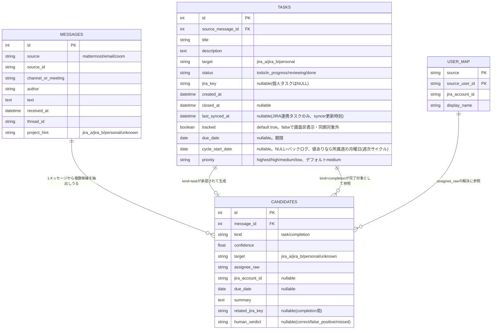

# データモデル（DB設計）

> 全体方針・技術スタックは`docs/design/design.md`、画面ごとの仕様は`docs/design/screen-*.md`を
> 参照。本書はDBスキーマ（`internal/taskstore/schema.sql`）自体の設計のみを扱う。

## テーブル一覧

| テーブル | 役割 | 主な列 |
|---|---|---|
| `messages` | 収集した生メッセージ。seed.goの固定サンプルに加え、Mattermost collector（後述「Mattermost collector（収集のみ）」参照）が実チャンネルから収集した投稿も保存される | `source`(mattermost/email/zoom), `channel_or_meeting`, `author`, `text`, `received_at`, `project_hint` |
| `candidates` | メッセージから抽出したタスク/完了候補。`kind=task`の候補は表示画面からは未使用（将来のextractor実装用に器のみ）だが、`kind=completion`の候補（完了報告）は「クローズ要求一覧」画面（`docs/design/screen-close-requests.md`参照）が参照する | `kind`(task/completion), `confidence`, `target`, `due_date`, `human_verdict` |
| `tasks` | ダッシュボードが実際に読み書きする本体 | `title`, `description`, `target`(jira_a/jira_b/personal), `status`(todo/in_progress/reviewing/done), `jira_key`, `created_at`, `closed_at`, `last_synced_at`, `tracked`(0/1), `due_date`(YYYY-MM-DD、nullable), `cycle_start_date`(所属週の月曜日、YYYY-MM-DD、nullable。NULL=バックログ), `priority`(highest/high/medium/low、デフォルトmedium) |
| `user_map` | 発言者⇔JIRAアカウントの対応（本パイロットでは表示画面からは未使用） | `source`, `source_user_id`, `jira_account_id`, `display_name` |

## ER図

`internal/taskstore/schema.sql`（実装）と一致させたテーブル間のリレーション・列定義。

- `messages.project_hint`は収集元の設定（`project_routing`）から機械的に付与する「対象
  プロジェクトの手がかり」。`project_routing`自体はDBではなく設定ファイルで管理するため、
  ER図には含めていない（利用方法は`docs/design/task-management-automation.md`の
  「抽出・分類」参照）。
- `tasks.jira_key`はJIRA起票済みなら値あり、個人タスクはNULLのまま自前ストアの実体となる。

## 週次サイクル（Cycles）

Linear風の「今週/バックログ」区分を`tasks.cycle_start_date`のみで表現し、独立した
Cycleテーブルは持たない（過去サイクルの履歴参照は要件外のため。比較検討の経緯は
`docs/adr/complete/cycle-data-model.md`参照）。`internal/taskstore/rollover.go`が
週境界（月曜0:00 JST）を跨いだ未完了タスクの`cycle_start_date`を現在の週の月曜日へ
書き換える（常駐goroutine＋起動時キャッチアップ実行、外部通信なし。詳細は
`docs/design/screen-board.md`「週次繰り越し」節、実行方式の検討経緯は
`docs/adr/complete/cycle-rollover-execution.md`参照）。

## 優先度（priority）

`tasks.priority`（highest/high/medium/low、デフォルトmedium）はLinear風の優先度概念を取り込んだ
もので、`target`（personal/jira_a/jira_b）問わず全タスク共通。カード上のバッジ表示にのみ使い、
並び順・レーン構造には影響しない（比較検討の経緯は`docs/adr/complete/task-priority-field.md`
参照）。JIRA連携タスクの優先度もローカル表示専用でJIRAへは書き込まない（`stubJiraTransition`と
同様、実同期はしない）。

## Mattermost collector（収集のみ）

「外部通信は一切行わない」という本パイロットの既定方針を、Mattermostに限り覆し、実際に
Mattermost APIをポーリングして`messages`テーブルへ保存するcollectorを実装している
（`internal/mattermost/`、collectorのみで抽出・JIRA自動起票は対象外。比較検討の経緯は
`docs/adr/complete/mattermost-collector-scope.md`・`mattermost-collector-language.md`参照）。

- 実装はGo（標準ライブラリ`net/http`のみ、Mattermost公式SDKやAnthropic SDK等の追加依存は無い）。
- 認証情報は環境変数（`MATTERMOST_BOT_TOKEN`/`MATTERMOST_SERVER_URL`/
  `MATTERMOST_CHANNEL_ROUTES`）で受け取り、`MATTERMOST_BOT_TOKEN`が未設定なら起動しない
  （既存のseedベースの動作には一切影響しない）。
- ポーリング間隔は10分（`internal/mattermost.PollInterval`、`docs/adr/complete/collection-trigger.md`
  で決定済みのcron定期ポーリング方式を踏襲）。cursor（前回取得位置）は新規テーブルを持たず、
  `messages`テーブル自体の該当チャンネルの最新`received_at`から都度算出する（Cyclesの
  `cycle_start_date`と同様、過剰なテーブル追加を避ける方針）。
- 重複防止は`source`+`source_id`（MattermostのPost ID）の存在チェックで行う。

## マイグレーション・実装上の注意

- `internal/taskstore/store.go`の`InitSchema()`は起動のたびに呼ばれ、`schema.sql`
  （go:embed）を実行した後、旧スキーマ（`status`が`open`/`done`の2値だった時代のデータ）を
  `todo`へ寄せるマイグレーションと、`due_date`/`cycle_start_date`/`priority`列が無ければ
  `ALTER TABLE`で追加するマイグレーションを実行する（Flask版の`db.py`の`init_db()`と
  同内容＋`cycle_start_date`/`priority`追加分。`priority`は`DEFAULT 'medium'`付きのため
  既存行にも自動的に値が入る）。
- `tracked`（真偽値、SQLite上は0/1の整数）は「非表示」の実体。削除ではなくこのフラグの
  反転のみで、行は物理的には常に残る（業務ルールの詳細は`docs/design/screen-board.md`参照）。
- クエリは`internal/taskstore/query.sql`に集約されており、`sqlc generate`で
  `query.sql.go`（型安全なGo関数）を生成する。生成コードは手で編集しない
  （`// Code generated by sqlc. DO NOT EDIT.`）。**生成コード（`db.go`/`models.go`/
  `query.sql.go`）はコミットせず、ローカルにも置かない方針**（`.gitignore`対象）。
  ビルド前に必ず`sqlc generate`を実行する必要がある（`build/Dockerfile`はビルド
  ステージ内で自動実行するため、Docker運用では意識不要。手順は`docs/design/design.md`の
  「開発時のビルド方法」参照）。

## 関連ドキュメント

- `docs/design/design.md` — 全体方針・技術スタック・デプロイ構成。
- `docs/design/screen-board.md` / `docs/design/screen-close-requests.md` — 各画面が
  このデータモデルをどう読み書きするか。
- `docs/design/task-management-automation.md` — 全体構想（collector/extractor等）における
  `messages`/`candidates`/`user_map`の使われ方（本書のER図・スキーマ定義は重複させず本書のみに
  置く）。
