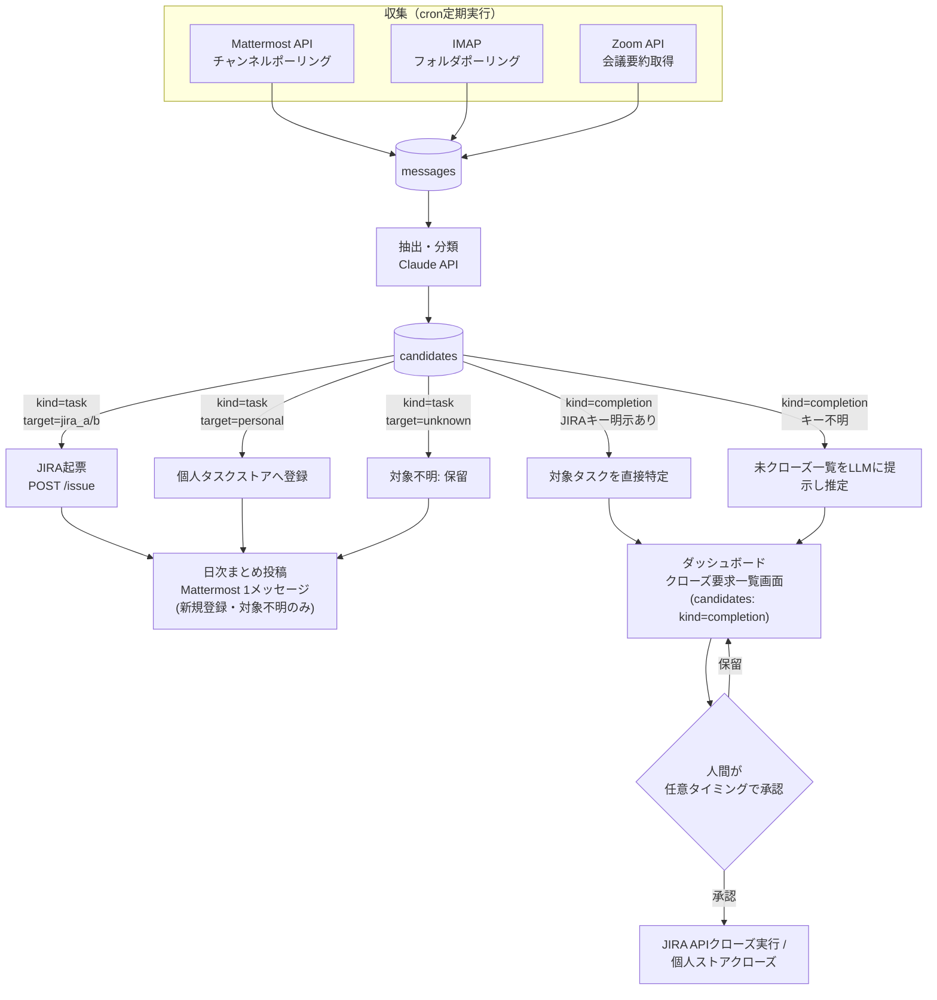
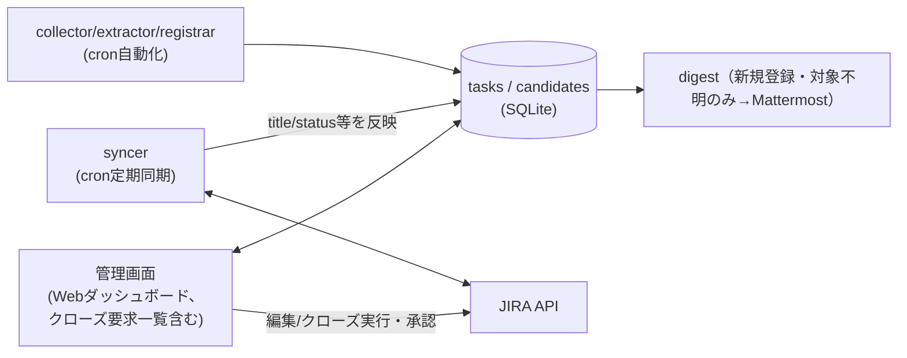

# タスク管理自動化 全体構想 設計書

## 位置づけ

本ドキュメントは、タスク管理自動化構想（JIRA2プロジェクト＋個人タスクをMattermost/メール/
Zoomから自動収集し、JIRA自動起票・完了候補提示まで行う）のうち、**まだ実装されていない
`extractor`/`syncer`/`registrar`/`digest`部分の確定した設計**をまとめたものである
（`collector`のうちMattermost分は2026-09-13にGoで実装済み。`docs/design/data-model.md`
「Mattermost collector（収集のみ）」参照。メール/Zoom collectorは未実装）。
各設計判断がなぜそうなったか（比較した案・採用理由）は、本書の各所からリンクしている
`docs/adr/proposals/`・`docs/adr/complete/`配下の論点ファイル（決定済みかつ実装済みのものは
`complete/`、実装がまだのものは`proposals/`）を参照。

このうち「スキーマとダッシュボードUI」部分はGo + sqlc + htmxで既にパイロット実装済みであり、
その詳細は`docs/design/design.md`を参照する（本書では重複させず、必要箇所からリンクする）。

## 背景・現状

- JIRAはプロジェクトごとに別管理（2プロジェクト）。
- 個人タスクはMattermost/メールで依頼されるが、専用の管理先がなく漏れやすい
  （→ [個人タスクの格納先](../adr/complete/personal-task-store.md)）。
- 完了判定(クローズ)は**候補提示＋人間承認**とする（自動クローズはしない。JIRAの誤クローズは
  気づかれにくく実害が大きいため。→
  [完了判定の自動化可否](../adr/complete/auto-close-policy.md)）。承認をどの画面で行うかは
  → [完了候補の承認UI](../adr/complete/completion-approval-ui.md)。
- 利用可能な基盤: Zoom文字起こし/要約API、Claude API等のLLM呼び出し、JIRA/Mattermostの
  bot・Webhook権限、Dockerコンテナ＋cronでの定期実行環境。
- 会議・メール本文を外部LLM API（Claude API等）に送信することはユーザー確認済み（問題なし。
  → [外部LLM API送信可否](../adr/proposals/data-handling-policy.md)）。

## 全体パイプライン

- **収集**: 収集源ごとに独立してcronポーリングし、共通の`messages`テーブルへ集約する。
- **抽出・分類**: `messages`1件ごとにClaude APIで構造化抽出し`candidates`へ格納する。
- **登録**: `target`と`kind`に応じて枝分かれし、新規登録・対象不明の候補は日次まとめ
  （digest）に集約される。
- **完了候補提示/実行**: クローズ候補（`kind=completion`）はMattermostではなく、ダッシュボード
  の「クローズ要求一覧」画面にDBから随時表示する。実際にクローズを実行するのは、ユーザーが
  この画面で任意のタイミングで承認した分のみ。

上図のクローズ候補まわり（CLOSE1/CLOSE2 → ダッシュボード → 承認 → EXEC）は
[完了候補の承認UI](../adr/complete/completion-approval-ui.md)で採用した
C3（ダッシュボード内クローズ要求一覧）の構成。当初はC2（Mattermost日次まとめ＋リアクション
承認）を採用していたが、2026-09-13にC3へ変更した。日次まとめ（digest）は新規登録・対象不明の
タスク候補のみを扱い、クローズ候補の承認フローはdigestから切り離されている。

## データモデル

DBスキーマ・ER図は`docs/design/data-model.md`を参照（パイロット実装の実スキーマと本構想の
データモデルは同一であり、二重に保守しない）。個人タスクストア
（[個人タスクの格納先](../adr/complete/personal-task-store.md)で採用）の実体は`tasks`
テーブルからここまで育てたもの。

以下は、まだ実装されていないextractor/registrar/digest（およびメール/Zoom collector）が
動く前提での、上記データモデルの使われ方（スキーマ自体の定義はdata-model.mdを参照、
ここでは重複させない）。

- `messages.project_hint`は収集元の設定（`project_routing`、後述「収集」参照）から機械的に
  付与する「対象プロジェクトの手がかり」。抽出時にLLMへ渡すコンテキストとして使う。
- `user_map`未整備の担当者はassignee未設定で登録し、日次まとめで人間に確認する。
- 本書内で単に「クローズ」と表現している箇所は、`tasks.status`
  （[タスクの進捗管理粒度](../adr/complete/status-granularity.md)で採用した4値カンバン）
  のうち`done`への遷移を指す。

## データの実体・同期方針

- **JIRA連携タスク**（`tasks.jira_key`が値を持つ行）は**JIRAが唯一の正**。ローカルの
  `title`/`description`/`status`等はJIRAの状態を映した**キャッシュ**として扱い、崩れてもJIRAから
  作り直せるものと位置づける。
- **syncer**（cron、収集と同程度の間隔・目安10〜15分毎）が追跡中の`jira_key`一覧をJIRA API
  （バッチ取得: JQL `key in (...)`）で問い合わせ、ローカルの`tasks`行へ反映し
  `last_synced_at`を更新する。
- ダッシュボードは通常ローカルDBを読んで高速表示し、「今すぐ更新」操作で対象タスクのみ即時に
  JIRAへ再取得できるようにする。
- ダッシュボードからの編集（title/description/due_date等）はローカルのみで完結させず、JIRA API
  へ書き込んだ上でローカルキャッシュも更新する（write-through。ローカルとJIRAの内容が
  ズレないようにする）。
- **個人タスク**（`jira_key`がNULLの行）は他に正となる外部システムが存在しないため、ローカルDBが
  そのまま正データとなる（syncer・write-through の対象外）。

## 追跡フラグ（`tracked`）

[「追跡除外」操作の範囲](../adr/complete/delete-vs-hide.md)で採用した方針。
「削除」（データ自体を消す）とは別に、**ローカルキャッシュには残したまま、画面表示や同期の対象
からだけ外す**設定を設ける。

- `tasks.tracked`（デフォルト`true`）を`false`にすると:
  - 管理画面のデフォルト一覧から非表示になる（「追跡除外分も表示」フィルタで確認は可能）。
  - `tracked=false`のJIRA連携タスクはsyncerの同期対象から外れる（無駄なJIRA API呼び出しを
    減らせる）。
  - 完了候補の対象特定（「未クローズタスク一覧」からLLMに推定させる処理）の候補からも除外する
    （関係ない古いタスクが完了候補として誤って挙がるのを防ぐ）。
  - 個人タスク・JIRA連携タスクのどちらにも使える。JIRA課題自体には一切影響しない。
- 管理画面から「追跡しない」「再度追跡する」をワンクリックで切り替え可能にする（可逆操作。
  削除ボタンは設けない）。ダッシュボードでの実装詳細は`docs/design/screen-board.md`
  （「非表示」の業務ルール）参照。

## 収集（収集源ごと）

トリガー方式は[収集トリガー方式](../adr/complete/collection-trigger.md)で
採用したcron定期ポーリング。

- **Mattermost**: **実装済み**（`internal/mattermost/`、Go）。10分間隔で監視対象チャンネル
  （複数可、`MATTERMOST_CHANNEL_ROUTES`環境変数で指定）をポーリングし`messages`へ保存。
  チャンネルごとに`project_hint`を設定。詳細は`docs/design/data-model.md`
  「Mattermost collector（収集のみ）」参照。
- **メール**: IMAPで監視対象フォルダ/ラベルをcronポーリング。フォルダごとに`project_hint`を設定。
- **Zoom**: cronでZoom API（Server-to-Server OAuth）を使い、終了済み会議一覧を取得。Zoom AI
  Companionの会議要約API（overview・next steps/action items）を取得し、要約全文を1件の
  `messages`（source=zoom）として保存する。会議トピック名・シリーズ名から`project_hint`を推定
  する。Zoom自身が抽出したaction itemsをextractorの入力に含めることで、ゼロから発言を解析する
  より精度を上げやすい。

## 抽出・分類

外部LLM APIへの送信可否は[外部LLM API送信可否](../adr/proposals/data-handling-policy.md)
で確認済み。

Claude APIに本文＋`project_hint`をコンテキストとして渡し、`kind/confidence/target/assignee_raw/
due_date/summary`を構造化JSONで抽出する。`target`は`project_hint`があれば強い手がかりとして使う
が、本文の内容と矛盾する場合は本文を優先し`confidence`を下げさせる。`assignee_raw`は生の名前/
メールアドレスのまま出力させ、後段で`user_map`を引いて`jira_account_id`に解決する（解決できな
ければ未設定のまま日次まとめで人間に確認を仰ぐ）。不明な項目は断定させず`unknown`とする。

## 登録（Registrar）

- **JIRA登録**: `target`が`jira_a`/`jira_b`で確定した候補はJIRA REST API
  （`POST /rest/api/2/issue`）で起票。descriptionに元発言/メール/会議へのリンクと引用を残す。
  `assignee`が解決できていれば設定し、できていなければ未設定で起票（担当者未設定の起票がある旨
  は日次まとめに含める）。
- **個人タスク登録**: `target=personal`の候補は自前ストア（`tasks`テーブル、`jira_key`はNULL）
  に登録する。
- **対象不明（`target=unknown`）**: 自動起票せず、日次まとめに「対象不明のタスク候補」として
  提示し、人間が対象（JIRA-A/B/個人）を指定した上で承認したときのみ登録する。

## 完了候補提示・クローズ

完了報告らしき発言を検知した場合、対象タスクの特定を2段階で行う。

1. 発言内にJIRAキー（例: `PROJ-123`）が明示されていればそれをそのまま`related_jira_key`とする。
2. 明示がなければ、`target`と`project_hint`から絞り込んだ「未クローズタスク一覧」
   （JIRA APIの検索結果＋自前ストアの`status != done`のタスク）をLLMに渡し、該当しそうな
   ものをconfidence付きで推定させる。

クローズ候補（`candidates`のうち`kind=completion`かつ`human_verdict`が未設定の行）は、
ダッシュボードの「クローズ要求一覧」画面に随時蓄積して表示する
（[完了候補の承認UI](../adr/complete/completion-approval-ui.md)で採用したC3）。
承認/却下の具体的な業務ルールは`docs/design/screen-close-requests.md`を参照（本書では
重複させない）。対象不明の完了報告（related_jira_keyが特定できないもの）はクローズ要求
一覧には出さず、日次まとめに「完了報告はあったが対象タスク不明」として掲載し、人間が
手動で対応する。

## 管理画面（ダッシュボード）との関係

日次まとめ(digest)は新規登録・対象不明タスクのMattermost通知用、ダッシュボードは随時の
ブラウジング・手動操作に加えてクローズ候補の承認UI（採用案C3）も担う。

JIRA連携タスクの読み取り・同期方針は前節「データの実体・同期方針」の通り（重複記述しない）。

ダッシュボード自体の対象データ・一覧/詳細確認・更新・追跡しない/再度追跡する・削除
（設けない方針）・技術スタックの詳細は、パイロット実装済みの`docs/design/design.md`
（および画面ごとの`docs/design/screen-board.md`・`docs/design/screen-close-requests.md`）を
参照（重複記述しない）。技術スタックの選定は
[ダッシュボードの実装技術](../adr/complete/dashboard-tech.md)、
statusの粒度は[タスクの進捗管理粒度](../adr/complete/status-granularity.md)、
削除を設けない方針は[「追跡除外」操作の範囲](../adr/complete/delete-vs-hide.md)
の採用結果。クローズ要求一覧画面（採用案C3）の業務ルール・現状の制約は
`docs/design/screen-close-requests.md`を参照。

## 日次まとめ（digest）の構成

1メッセージの中で以下をカテゴリ分けして提示する。クローズ候補の承認はダッシュボード側
（クローズ要求一覧、採用案C3）で行うため、digestには含めない。

1. 新規登録済みタスク（JIRA/個人、当日分）
2. 対象不明のため保留中のタスク候補（人間の判定待ち）
3. 完了報告はあったが対象タスク不明（手動対応が必要）

## リスク・注意点

- 誤検知（過検知/見逃し）: 初期は「登録も提案のみ」でノイズ率を計測してから自動登録の範囲を
  広げる段階導入が安全。
- 監視範囲: Mattermost/メールの全チャンネル・全メールを対象にせず、監視対象を明示的に絞る
  設計とする。
- Zoom APIのレート制限・必要スコープ（会議情報・会議要約の読み取り権限）を事前に確認する必要
  がある。
- `user_map`が未整備だと担当者不明・対象不明が増えるため、初期構築時に主要メンバーの
  Mattermostユーザー名/メールアドレスとJIRAアカウントIDの対応表をあらかじめ用意しておく。
- 複数プロジェクトが混在するチャンネル/メールフォルダでは`project_hint`だけでは判定が弱いため、
  本文内容を優先しつつconfidenceで保留に倒す設計としている。

## 技術スタック（collector/extractor/syncer/registrar/digest側）

**Mattermost collectorはGoで実装済み**（`internal/mattermost/`、ダッシュボードと同じ
taskmanagerリポジトリ・同じバイナリ内の常駐goroutine。標準ライブラリ`net/http`のみで
Mattermost REST APIを呼び出し、外部SDK依存は無い）。当初はPython想定だったが、
Anthropic公式Go SDK（`github.com/anthropics/anthropic-sdk-go`）の存在を確認したことで、
将来extractorをAI(Claude API)で実装する場合もGoで完結でき、Pythonを新規に持ち込む
技術的必然性が無いと判断した（比較検討の経緯は
`docs/adr/complete/mattermost-collector-language.md`参照）。

未実装のメール/Zoom collector・extractor・syncer・registrar・digestについては、引き続き
以下の想定（Python、リポジトリの既存方針どおりルートの`.venv`/uv環境を使用、`sqlite3`標準
ライブラリ、`requests`でJIRA/Zoom各API呼び出し（ZoomはServer-to-Server OAuth）、`anthropic`
SDKでClaude API呼び出し、Dockerコンテナ＋cronで定期実行）を置くが、Mattermost collectorの
実装経験を踏まえるとこれらもGoで実装できる可能性があり、着手時に改めて技術選定を見直す
余地がある。

ダッシュボード側の技術スタック（Go + sqlc + htmx）は別選定であり、`docs/design/design.md`と
[ダッシュボードの実装技術](../adr/complete/dashboard-tech.md)を参照。

## 想定される次の一手

1. **Mattermost collector（収集のみ）は実装済み**（`internal/mattermost/`、2026-09-13。
   `docs/design/data-model.md`「Mattermost collector（収集のみ）」参照）。認証情報
   （Bot Token・サーバーURL・`MATTERMOST_CHANNEL_ROUTES`）はユーザーが自身の環境で設定する。
2. 残る認証情報・権限の準備（ユーザー側）: JIRA APIトークン、Zoom Server-to-Server OAuth
   アプリ（会議情報・会議要約の読み取りスコープ）、メールのIMAP認証情報。
3. `user_map`（主要メンバーの初期データ）を整備する（`project_routing`のうちMattermost分は
   `MATTERMOST_CHANNEL_ROUTES`で代替済み。メール/Zoom分は別途整備が必要）。
4. extractor・registrar（JIRA登録/個人タスク登録）・digest（新規登録・対象不明タスクの
   日次まとめ投稿）、メール/Zoom collectorを実装する（管理画面（ダッシュボード）は
   スキーマ・クローズ要求一覧画面含めパイロット実装済み。`docs/design/design.md`参照）。
5. 運用開始後、precision/recall（登録・クローズ候補それぞれ）を継続的にモニタリングし、
   プロンプト・`project_routing`・confidence閾値を調整する。

## 関連ドキュメント

- `docs/adr/proposals/`・`docs/adr/complete/` — 本書の各設計判断がなぜそうなったか（案の比較・
  採用理由）を論点ごとに記録したADR（本書の各所からリンクしている個別ファイル参照）。
- `docs/design/data-model.md` — DBスキーマ・ER図（本書のデータモデルと同一の実装済みスキーマ）。
- `docs/design/design.md` — 「スキーマとダッシュボードUI」部分のパイロット実装（Go+sqlc+htmx）
  の全体方針。
- `docs/design/screen-board.md` / `docs/design/screen-close-requests.md` — ダッシュボード
  各画面（カンバンボード／クローズ要求一覧）の詳細仕様。
