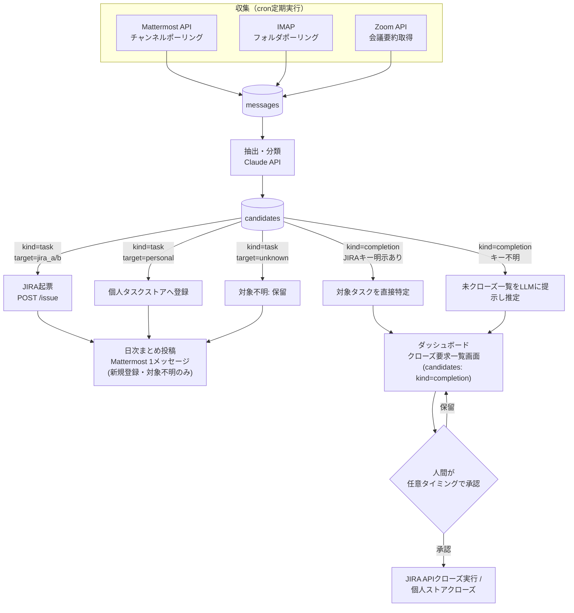
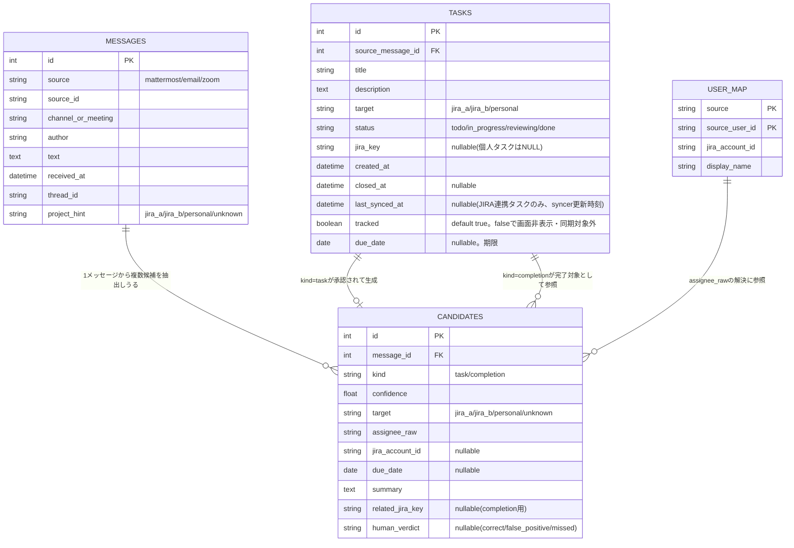
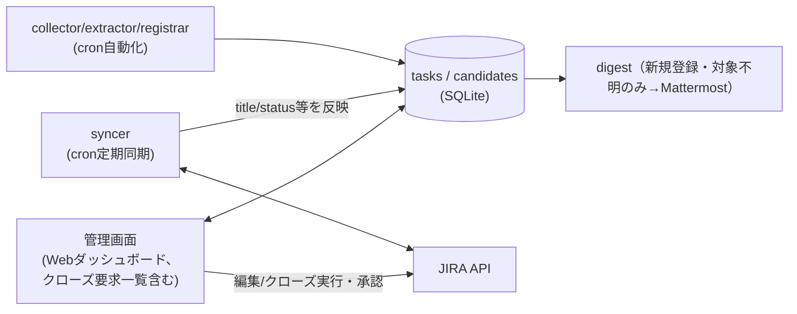

# タスク管理自動化 全体構想 設計書

## 位置づけ

本ドキュメントは、タスク管理自動化構想（JIRA2プロジェクト＋個人タスクをMattermost/メール/
Zoomから自動収集し、JIRA自動起票・完了候補提示まで行う）のうち、**まだ実装されていない
`collector`/`extractor`/`syncer`/`registrar`/`digest`部分の確定した設計**をまとめたものである。
各設計判断がなぜそうなったか（比較した案・採用理由）は
`docs/adr/proposals/task-management-automation.md`（索引）以下の論点ファイルを参照。

このうち「スキーマとダッシュボードUI」部分はGo + sqlc + htmxで既にパイロット実装済みであり、
その詳細は`docs/design/design.md`を参照する（本書では重複させず、必要箇所からリンクする）。

## 背景・現状

- JIRAはプロジェクトごとに別管理（2プロジェクト）。
- 個人タスクはMattermost/メールで依頼されるが、専用の管理先がなく漏れやすい
  （→ 個人タスクの格納先は[論点A](../adr/complete/task-management-automation--a-personal-task-store.md)）。
- 完了判定(クローズ)は**候補提示＋人間承認**とする（自動クローズはしない）。JIRAの誤クローズは
  気づかれにくく実害が大きいため
  （→ 承認UIは[論点C](../adr/complete/task-management-automation--c-completion-approval-ui.md)）。
- 利用可能な基盤: Zoom文字起こし/要約API、Claude API等のLLM呼び出し、JIRA/Mattermostの
  bot・Webhook権限、Dockerコンテナ＋cronでの定期実行環境。
- 会議・メール本文を外部LLM API（Claude API等）に送信することはユーザー確認済み（問題なし。
  → [論点G](../adr/proposals/task-management-automation--g-data-handling-policy.md)）。

## 全体パイプライン

- **収集**: 収集源ごとに独立してcronポーリングし、共通の`messages`テーブルへ集約する。
- **抽出・分類**: `messages`1件ごとにClaude APIで構造化抽出し`candidates`へ格納する。
- **登録**: `target`と`kind`に応じて枝分かれし、新規登録・対象不明の候補は日次まとめ
  （digest）に集約される。
- **完了候補提示/実行**: クローズ候補（`kind=completion`）はMattermostではなく、ダッシュボード
  の「クローズ要求一覧」画面にDBから随時表示する。実際にクローズを実行するのは、ユーザーが
  この画面で任意のタイミングで承認した分のみ。

上図のクローズ候補まわり（CLOSE1/CLOSE2 → ダッシュボード → 承認 → EXEC）は
[論点C](../adr/complete/task-management-automation--c-completion-approval-ui.md)で採用した
C3（ダッシュボード内クローズ要求一覧）の構成。当初はC2（Mattermost日次まとめ＋リアクション
承認）を採用していたが、2026-09-13にC3へ変更した。日次まとめ（digest）は新規登録・対象不明の
タスク候補のみを扱い、クローズ候補の承認フローはdigestから切り離されている。

## データモデル（ER図、SQLite）

個人タスクストア（[論点A](../adr/complete/task-management-automation--a-personal-task-store.md)で
採用）の実体もここから育てる。

`tasks`テーブルのスキーマ・実装は`docs/design/design.md`（パイロット実装）の
`internal/taskstore/schema.sql`が正。本ERはそれと一致させてある。

- `messages.project_hint`は収集元の設定（`project_routing`、後述）から機械的に付与する
  「対象プロジェクトの手がかり」。抽出時にLLMへ渡すコンテキストとして使う。
- `tasks.jira_key`はJIRA起票済みなら値あり、個人タスクはNULLのまま自前ストアの実体となる。
- `user_map`未整備の担当者はassignee未設定で登録し、日次まとめで人間に確認する。
- `project_routing`（監視対象チャンネル/メールフォルダ/Zoom会議シリーズ名 → `project_hint`の
  マッピング）はDBではなく設定ファイルで管理するため、ER図には含めていない。
- `tasks.status`は[論点E](../adr/complete/task-management-automation--e-status-granularity.md)の
  採用により`todo`/`in_progress`/`reviewing`/`done`の4値カンバンとし、`tasks.due_date`
  （期限、nullable）を新設した。本書内で単に「クローズ」と表現している箇所は、実体はこの
  4値のうち`done`への遷移を指す。
- `candidates`・`user_map`テーブルはスキーマとしては用意済み（ダッシュボードのパイロット実装
  にも含まれる）だが、collector/extractorが未実装のため、現時点ではダッシュボード側からは
  未使用（器のみ）。

## データの実体・同期方針

- **JIRA連携タスク**（`tasks.jira_key`が値を持つ行）は**JIRAが唯一の正**。ローカルの
  `title`/`description`/`status`等はJIRAの状態を映した**キャッシュ**として扱い、崩れてもJIRAから
  作り直せるものと位置づける。
- **syncer**（cron、収集と同程度の間隔・目安10〜15分毎）が追跡中の`jira_key`一覧をJIRA API
  （バッチ取得: JQL `key in (...)`）で問い合わせ、ローカルの`tasks`行へ反映し
  `last_synced_at`を更新する。
- ダッシュボードは通常ローカルDBを読んで高速表示し、「今すぐ更新」操作で対象タスクのみ即時に
  JIRAへ再取得できるようにする。
- ダッシュボードからの編集（title/description/due_date等）はローカルのみで完結させず、JIRA API
  へ書き込んだ上でローカルキャッシュも更新する（write-through。ローカルとJIRAの内容が
  ズレないようにする）。
- **個人タスク**（`jira_key`がNULLの行）は他に正となる外部システムが存在しないため、ローカルDBが
  そのまま正データとなる（syncer・write-through の対象外）。

## 追跡フラグ（`tracked`）

[論点F](../adr/complete/task-management-automation--f-delete-vs-hide.md)で採用した方針。
「削除」（データ自体を消す）とは別に、**ローカルキャッシュには残したまま、画面表示や同期の対象
からだけ外す**設定を設ける。

- `tasks.tracked`（デフォルト`true`）を`false`にすると:
  - 管理画面のデフォルト一覧から非表示になる（「追跡除外分も表示」フィルタで確認は可能）。
  - `tracked=false`のJIRA連携タスクはsyncerの同期対象から外れる（無駄なJIRA API呼び出しを
    減らせる）。
  - 完了候補の対象特定（「未クローズタスク一覧」からLLMに推定させる処理）の候補からも除外する
    （関係ない古いタスクが完了候補として誤って挙がるのを防ぐ）。
  - 個人タスク・JIRA連携タスクのどちらにも使える。JIRA課題自体には一切影響しない。
- 管理画面から「追跡しない」「再度追跡する」をワンクリックで切り替え可能にする（可逆操作。
  削除ボタンは設けない）。ダッシュボードでの実装詳細は`docs/design/design.md`
  （「非表示」の業務ルール）参照。

## 収集（収集源ごと）

トリガー方式は[論点B](../adr/proposals/task-management-automation--b-collection-trigger.md)で
採用したcron定期ポーリング。

- **Mattermost**: cron10分間隔で監視対象チャンネル（複数可、プロジェクトA/B用チャンネルや個人
  DMなど）をポーリングし`messages`へ保存。チャンネルごとに`project_hint`を設定。
- **メール**: IMAPで監視対象フォルダ/ラベルをcronポーリング。フォルダごとに`project_hint`を設定。
- **Zoom**: cronでZoom API（Server-to-Server OAuth）を使い、終了済み会議一覧を取得。Zoom AI
  Companionの会議要約API（overview・next steps/action items）を取得し、要約全文を1件の
  `messages`（source=zoom）として保存する。会議トピック名・シリーズ名から`project_hint`を推定
  する。Zoom自身が抽出したaction itemsをextractorの入力に含めることで、ゼロから発言を解析する
  より精度を上げやすい。

## 抽出・分類

外部LLM APIへの送信可否は[論点G](../adr/proposals/task-management-automation--g-data-handling-policy.md)
で確認済み。

Claude APIに本文＋`project_hint`をコンテキストとして渡し、`kind/confidence/target/assignee_raw/
due_date/summary`を構造化JSONで抽出する。`target`は`project_hint`があれば強い手がかりとして使う
が、本文の内容と矛盾する場合は本文を優先し`confidence`を下げさせる。`assignee_raw`は生の名前/
メールアドレスのまま出力させ、後段で`user_map`を引いて`jira_account_id`に解決する（解決できな
ければ未設定のまま日次まとめで人間に確認を仰ぐ）。不明な項目は断定させず`unknown`とする。

## 登録（Registrar）

- **JIRA登録**: `target`が`jira_a`/`jira_b`で確定した候補はJIRA REST API
  （`POST /rest/api/2/issue`）で起票。descriptionに元発言/メール/会議へのリンクと引用を残す。
  `assignee`が解決できていれば設定し、できていなければ未設定で起票（担当者未設定の起票がある旨
  は日次まとめに含める）。
- **個人タスク登録**: `target=personal`の候補は自前ストア（`tasks`テーブル、`jira_key`はNULL）
  に登録する。
- **対象不明（`target=unknown`）**: 自動起票せず、日次まとめに「対象不明のタスク候補」として
  提示し、人間が対象（JIRA-A/B/個人）を指定した上で承認したときのみ登録する。

## 完了候補提示・クローズ

完了報告らしき発言を検知した場合、対象タスクの特定を2段階で行う。

1. 発言内にJIRAキー（例: `PROJ-123`）が明示されていればそれをそのまま`related_jira_key`とする。
2. 明示がなければ、`target`と`project_hint`から絞り込んだ「未クローズタスク一覧」
   （JIRA APIの検索結果＋自前ストアの`status != done`のタスク）をLLMに渡し、該当しそうな
   ものをconfidence付きで推定させる。

クローズ候補（`candidates`のうち`kind=completion`かつ`human_verdict`が未設定の行）は、
ダッシュボードの「クローズ要求一覧」画面に随時蓄積して表示する
（[論点C](../adr/complete/task-management-automation--c-completion-approval-ui.md)で採用した
C3）。ユーザーが任意のタイミングでこの画面を開き、個別またはまとめて承認すると、承認された
分だけJIRA API／自前ストアでクローズを実行し、`candidates.human_verdict`を`correct`に更新する。
却下した場合は`false_positive`として記録し、一覧から外す。対象不明の完了報告
（related_jira_keyが特定できないもの）はクローズ要求一覧には出さず、日次まとめに
「完了報告はあったが対象タスク不明」として掲載し、人間が手動で対応する。

## 管理画面（ダッシュボード）との関係

日次まとめ(digest)は新規登録・対象不明タスクのMattermost通知用、ダッシュボードは随時の
ブラウジング・手動操作に加えてクローズ候補の承認UI（論点C3）も担う。

JIRA連携タスクについては、DASHの読み取りは基本ローカルDB（キャッシュ）から行い、正データである
JIRAとの整合はsyncerが定期的に保つ。DASHからの編集・クローズはJIRA APIへ直接書き込み、成功後に
ローカルキャッシュへも反映する。

ダッシュボード自体の対象データ・一覧/詳細確認・更新・追跡しない/再度追跡する・削除
（設けない方針）・技術スタックの詳細は、パイロット実装済みの`docs/design/design.md`を参照
（重複記述しない）。技術スタックの選定は
[論点D](../adr/complete/task-management-automation--d-dashboard-tech.md)、
statusの粒度は[論点E](../adr/complete/task-management-automation--e-status-granularity.md)、
削除を設けない方針は[論点F](../adr/complete/task-management-automation--f-delete-vs-hide.md)
の採用結果。

**クローズ要求一覧（[論点C](../adr/complete/task-management-automation--c-completion-approval-ui.md)
のC3で採用、パイロット実装済み）**: `candidates`のうち`kind=completion`かつ`human_verdict`が
未設定の行を一覧表示し、承認/却下をワンクリックで行える画面をダッシュボードに追加した
（`POST /candidates/{id}/approve`・`POST /candidates/{id}/reject`）。詳細は前節
「完了候補提示・クローズ」、実装の詳細は`docs/design/design.md`の「クローズ要求一覧」の
業務ルール節を参照。ただし実データを投入するcollector/extractorが未実装のため、実運用では
この画面にデータが表示されない（現状は`seed.go`のサンプルデータでのみ動作確認できる）。

## 日次まとめ（digest）の構成

1メッセージの中で以下をカテゴリ分けして提示する。クローズ候補の承認はダッシュボード側
（論点C3）で行うため、digestには含めない。

1. 新規登録済みタスク（JIRA/個人、当日分）
2. 対象不明のため保留中のタスク候補（人間の判定待ち）
3. 完了報告はあったが対象タスク不明（手動対応が必要）

## リスク・注意点

- 誤検知（過検知/見逃し）: 初期は「登録も提案のみ」でノイズ率を計測してから自動登録の範囲を
  広げる段階導入が安全。
- 監視範囲: Mattermost/メールの全チャンネル・全メールを対象にせず、監視対象を明示的に絞る
  設計とする。
- Zoom APIのレート制限・必要スコープ（会議情報・会議要約の読み取り権限）を事前に確認する必要
  がある。
- `user_map`が未整備だと担当者不明・対象不明が増えるため、初期構築時に主要メンバーの
  Mattermostユーザー名/メールアドレスとJIRAアカウントIDの対応表をあらかじめ用意しておく。
- 複数プロジェクトが混在するチャンネル/メールフォルダでは`project_hint`だけでは判定が弱いため、
  本文内容を優先しつつconfidenceで保留に倒す設計としている。

## 技術スタック（collector/extractor/syncer/registrar/digest側）

Python（リポジトリの既存方針どおりルートの`.venv`/uv環境を使用）、`sqlite3`標準ライブラリ、
`requests`でMattermost/JIRA/Zoom各API呼び出し（ZoomはServer-to-Server OAuth）、`anthropic` SDK
でClaude API呼び出し、Dockerコンテナ＋cronで定期実行。

ダッシュボード側の技術スタック（Go + sqlc + htmx）は別選定であり、`docs/design/design.md`と
[論点D](../adr/complete/task-management-automation--d-dashboard-tech.md)を参照。

## 想定される次の一手

1. 認証情報・権限の準備（ユーザー側）: Mattermost botトークン、JIRA APIトークン、Zoom
   Server-to-Server OAuthアプリ（会議情報・会議要約の読み取りスコープ）。
2. `project_routing`（監視対象チャンネル/メールフォルダ/Zoom会議シリーズと`project_hint`の対応）
   と`user_map`（主要メンバーの初期データ）を整備する。
3. collector（mattermost/email/zoom）・extractor・registrar（JIRA登録/個人タスク登録）・
   digest（新規登録・対象不明タスクの日次まとめ投稿）を実装する（管理画面（ダッシュボード）
   はスキーマ・クローズ要求一覧画面含めパイロット実装済み。`docs/design/design.md`参照）。
4. 運用開始後、precision/recall（登録・クローズ候補それぞれ）を継続的にモニタリングし、
   プロンプト・`project_routing`・confidence閾値を調整する。

## 関連ドキュメント

- `docs/adr/proposals/task-management-automation.md`（索引） — 本書の各設計判断がなぜそうなったか
  （案の比較・採用理由）を論点ごとに記録したADR。
- `docs/design/design.md` — 「スキーマとダッシュボードUI」部分のパイロット実装（Go+sqlc+htmx）
  の詳細設計書。
